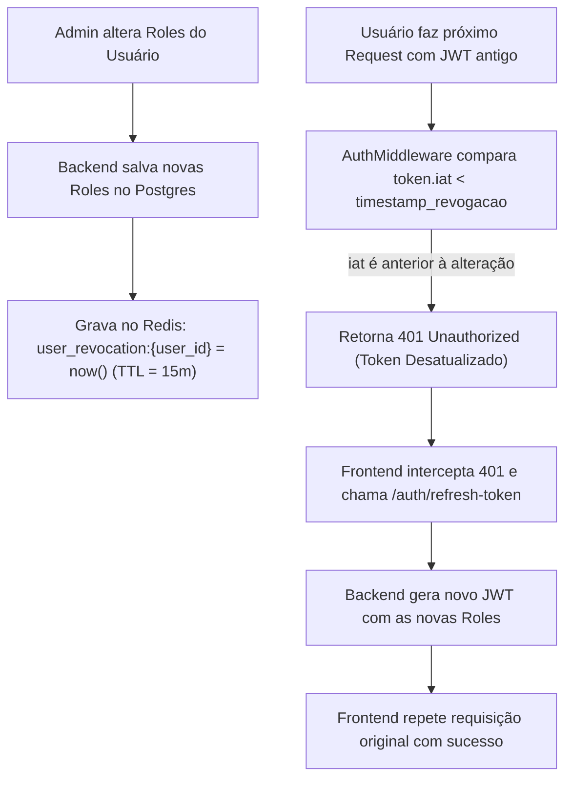
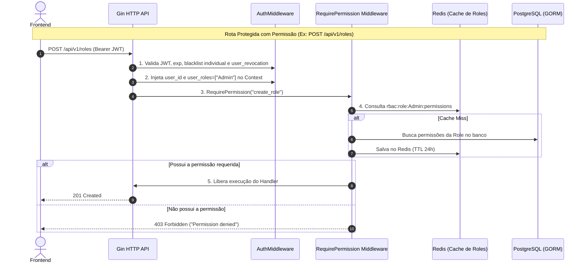

# Planejamento de Arquitetura: RBAC com Cache de Roles no Redis, Roles no JWT e Reflexão Imediata

## 1. Visão Geral e Decisões de Arquitetura

### A. Onde armazenar Roles e Permissões?
1. **Roles no JWT (Access Token de curta duração - 15 min):**
   - O JWT armazena a identidade do usuário (`sub: user_id`) e a lista de papéis (`roles: ["Admin", "Manager"]`).
   - Mantém o token leve (~25 a 30 bytes adicionais).
2. **Permissões no Redis (Cache por Role):**
   - Chave: `rbac:role:{role_name}:permissions` (Ex: `rbac:role:Admin:permissions` ➔ `["create_role", "view_role", ...]`).
   - Ocupa memória apenas para o número de **Roles** cadastradas no sistema ($O(\text{Roles})$ em vez de $O(\text{Usuários})$).
   - O Redis armazena meros kilobytes, independentemente de haver 10 ou 1 milhão de usuários.

---

### B. Como refletir a alteração de Role do usuário IMEDIATAMENTE?
Como o JWT fica com o cliente, utilizamos o padrão **`valid_after` / Revogação Inteligente com TTL Curto**:



- **Zero inchaço no Redis:** A chave `user_revocation:{user_id}` só é criada no instante em que as roles de um usuário mudam e possui TTL de 15 minutos (tempo de expiração do JWT). Após isso, o Redis a descarta automaticamente.

---

### C. Invalidação de Permissões de uma Role
- Ao alterar as permissões de uma Role (`AddPermissions`, `RemovePermissions`, `Update`, `Delete`):
  - O backend remove a chave correspondente no Redis: `DEL rbac:role:{role_name}:permissions`.
  - Todos os usuários com aquela role passam a ter suas permissões atualizadas no exato próximo request.

---

### D. Endpoint `/api/v1/users/me`
- Rota para o frontend obter o perfil e todas as permissões no boot da aplicação / pós-login:
  ```json
  {
    "id": "a1b2c3d4-e5f6-7a8b-9c0d-1e2f3a4b5c6d",
    "name": "John Doe",
    "email": "john.doe@example.com",
    "roles": ["Admin"],
    "permissions": ["create_role", "update_role", "delete_role", "view_role"],
    "created_at": "2026-01-01T00:00:00Z",
    "updated_at": "2026-01-01T00:00:00Z"
  }
  ```
- O frontend armazena essas permissões no estado global (Pinia, Redux, Zustand) para renderização condicional da interface (`v-if="hasPermission('create_role')"`).

---

## 2. Mapa de Alterações no Código

```
internal/
├── domain/
│   ├── errors.go                # Adicionar ErrTypeForbidden (HTTP 403)
│   ├── auth.go                  # Métodos de revogação de usuário na interface TokenBlackList
│   ├── permission.go            # Tipagem forte com PermissionName no struct
│   └── role.go                  # Métodos de busca de permissões por nomes de roles
├── repository/
│   ├── rbac_cache.go            # [NOVO] Gerenciamento de cache de permissões por Role no Redis
│   └── token_blacklist.go       # Implementar RevokeUserTokens e IsUserRevoked com timestamp
├── usecase/
│   ├── user_usecase.go          # CustomClaims com Roles, GetMe e disparo de revogação em AddRoles/RemoveRoles
│   └── role_usecase.go          # Cache-aside de permissões por role e invalidação no Redis
└── delivery/http/
    ├── middleware/
    │   ├── auth_middleware.go   # Extração de user_roles e checagem de IsUserRevoked
    │   ├── rbac_middleware.go   # [NOVO] RequirePermission(roleUseCase, perm)
    │   └── response.go          # Mapeamento do ErrTypeForbidden para 403
    ├── v1/
    │   └── user_handler.go      # Handlers GetMe, AddRoles, RemoveRoles
    └── router.go                # Registro de /users/me e proteção das rotas com RequirePermission
```

---

## 3. Fluxo de Execução das Requisições


