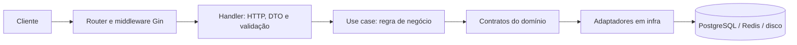

# Gin Boilerplate

Boilerplate para APIs REST em Go com Gin, PostgreSQL e Redis. Ele oferece uma base pronta para autenticação, autorização por papéis e permissões, gestão de usuários, filas e tarefas agendadas, mantendo as regras de negócio separadas dos detalhes de HTTP e infraestrutura.

Foi pensado para serviços backend que podem começar como um monólito modular. Não tenta oferecer uma plataforma de microserviços, um painel administrativo ou um sistema completo de identidade com MFA, verificação de e-mail e recuperação de senha.

## Visão geral

- **O que é:** uma API REST inicial com recursos comuns já implementados.
- **Por que existe:** para iniciar novos serviços sem copiar manualmente autenticação, persistência, migrations, autorização e infraestrutura recorrente.
- **Como executar:** configure `.env`, suba PostgreSQL e Redis com Docker Compose e rode `./app dev --services --swagger --migrate --seed`.
- **Como evoluir:** implemente regras em `internal/<feature>/application`, mantenha contratos no domínio e conecte adaptadores na infraestrutura e no bootstrap.

## Funcionalidades

- Cadastro, login, JWT de acesso, refresh token com rotação, logout, troca de senha e controle de sessões.
- Transporte de tokens em JSON ou cookies, configurável por `AUTH_TOKEN_TRANSPORT`.
- Usuários, papéis e permissões RBAC; consulta de permissões no banco a cada autorização.
- Perfil e imagem de usuário, armazenada em disco local e validada antes de salvar.
- PostgreSQL com GORM, migrations SQL versionadas e seeders transacionais.
- Redis para blacklist de JWT, rate limiting e filas Asynq; filas usam um database Redis separado.
- Worker e scheduler separados. O cron existente remove refresh tokens expirados após o período de retenção.
- Validação de payloads, paginação, filtros, erros HTTP padronizados e documentação Swagger/OpenAPI.
- Logs estruturados, `X-Request-ID`, health checks e alguns headers de segurança.
- Activity logs administrativos imutáveis para usuários e RBAC, consultáveis com a permissão `view_activity_log`.
- Adaptador SMTP disponível, mas ainda sem fluxo de produto que envie e-mails.

## Stack

| Área | Tecnologia | Uso |
| --- | --- | --- |
| Linguagem | Go 1.27.0 ou superior | API, worker, scheduler e ferramenta de migrations |
| HTTP | Gin 1.12 | Rotas, middleware e handlers |
| Banco relacional | PostgreSQL 18 | Persistência principal |
| ORM | GORM 1.31 | Repositórios e transações |
| Migrations | golang-migrate | Migrations SQL `up`/`down` |
| Cache e rate limiting | Redis 8.10, go-redis e redis_rate | Blacklist de JWT, rate limits e suporte à fila |
| Filas e cron | Asynq 0.26 | Enfileiramento em Redis, workers e scheduler |
| Tokens | golang-jwt/jwt v5 | JWT HS256 para tokens de acesso |
| Documentação | swaggo / Swagger | OpenAPI gerado a partir das anotações dos handlers |
| Logging | `log/slog` | Logs estruturados no console e em arquivo |
| Containers | Docker | Imagem multi-stage; Compose para PostgreSQL e Redis locais |

As versões das dependências Go estão declaradas em [`go.mod`](go.mod). Não é necessário Node.js.

## Arquitetura

O projeto é um **monólito modular com inspiração em Clean Architecture e arquitetura hexagonal**. Não é uma implementação estrita de DDD.

```text
app                    Launcher local
app.cmd                Launcher para Windows
cmd/app/               Único ponto de entrada Go
config/                Configuração por comando
db/migrations/         Migrations SQL versionadas
internal/
  cli/                 Catálogo, handlers e supervisão dos comandos
  bootstrap/           Composition root das aplicações
  users/               Domínio, aplicação e adapters de usuários
  roles/               Domínio, aplicação e adapters de papéis
  permissions/         Domínio, aplicação e adapters de permissões
  refresh_tokens/      Domínio, aplicação e adapters de sessões
  activity_logs/       Domínio, aplicação e adapters de auditoria
  application/         Casos de uso compartilhados
  domain/              Portas e tipos compartilhados independentes de infraestrutura
  delivery/http/       Router, middleware e respostas compartilhadas
  infra/               Infraestrutura compartilhada
docs/                  Especificação Swagger gerada
```

### Fluxo de uma requisição



Handlers convertem HTTP em chamadas de caso de uso; não devem concentrar regras de negócio. Use cases dependem de contratos do domínio, não de Gin ou GORM. Repositórios e integrações externas ficam em `infra`; `bootstrap` liga as implementações aos contratos.

### Regras para novas features

1. Defina ou reutilize as entidades e contratos necessários em `internal/<feature>/domain`.
2. Implemente a regra em `internal/<feature>/application`; evite colocar regra de negócio no handler ou no repositório.
3. Adicione o adaptador de banco ou serviço externo em `internal/<feature>/adapters` e injete-o em `internal/bootstrap`.
4. Para HTTP, crie DTOs e handlers em `internal/<feature>/adapters/http`; registre a rota em `router.go` e aplique autenticação/permissão adequada.
5. Se alterar o schema, crie os pares SQL `up`/`down` com `./app make:migration nome` e escreva ambos.
6. Atualize as anotações Swagger e gere os arquivos com `./app docs:generate`.
7. Rode `go test ./...` e confira os casos que ainda precisam de testes específicos.

Handlers usam `bindJSON` para limitar e validar payloads. O validator rejeita campos JSON desconhecidos. Use `shared.AppError` para erros de aplicação, DTOs para o contrato HTTP e os métodos existentes de paginação/filtro nas rotas de listagem.

## Pré-requisitos

- Go **1.27.0+**. Linux/macOS usam `./app`; Windows usa `.\app.cmd` em PowerShell ou `app.cmd` em CMD.
- Docker Engine com o comando `docker compose`, ou instâncias locais compatíveis de PostgreSQL 18 e Redis 8.10.
- `openssl` é opcional e serve para gerar um segredo JWT.

### Instalação e execução local

```bash
cp .env.example .env
```

Edite `.env`: defina `JWT_SECRET` com pelo menos 32 caracteres e `ADMIN_PASSWORD` com pelo menos 12 caracteres. Para gerar um segredo aleatório:

```bash
openssl rand -hex 32
```

Suba os serviços locais e inicie a aplicação com migrations e seeders:

```bash
./app dev --services --swagger --migrate --seed
```

No PowerShell, use `app.cmd`:

```powershell
.\app.cmd dev --services --swagger --migrate --seed
```

`ADMIN_PASSWORD` é obrigatório ao executar seeders. Para iniciar os processos depois de preparar o banco, use `./app dev`. Para rodar somente a API, use `./app serve`; para executar seeders separadamente, use `./app db:seed`.

- API: <http://localhost:8080>
- Swagger UI: <http://localhost:8080/swagger/index.html> (desabilitado em `ENVIRONMENT=production`)
- Liveness: `GET /health/live`
- Readiness: `GET /health/ready` (verifica PostgreSQL e Redis)

`docker compose up -d --wait postgres redis` inicia somente PostgreSQL e Redis. Para parar os serviços sem apagar os volumes, use `docker compose down`.

## Variáveis de ambiente

`.env.example` lista a configuração usada. Valores definidos no ambiente do processo prevalecem sobre o `.env`.

### Aplicação e HTTP

| Variável | Valor no exemplo / padrão | Descrição |
| --- | --- | --- |
| `ENVIRONMENT` | `development` | `development`, `production` ou `test`; produção ativa logs JSON no console, modo Gin release, cookies `Secure` e TLS verificado para Redis. |
| `PORT` | `8080` | Porta HTTP da API. |
| `HTTP_READ_HEADER_TIMEOUT` | `5s` | Limite para receber os headers. |
| `HTTP_READ_TIMEOUT` | `10s` | Timeout de leitura HTTP. |
| `HTTP_WRITE_TIMEOUT` | `10s` | Timeout de escrita HTTP. |
| `HTTP_IDLE_TIMEOUT` | `60s` | Timeout de conexões ociosas. |
| `HTTP_SHUTDOWN_TIMEOUT` | `10s` | Tempo máximo para encerrar o servidor HTTP. |
| `TRUSTED_PROXIES` | vazio | Lista de IPs/CIDRs de proxies confiáveis, separada por vírgula. Deixe vazia se não houver proxy confiável. |
| `CORS_ALLOWED_ORIGINS` | `http://localhost:3000` no exemplo | Origens permitidas, separadas por vírgula. Obrigatório em modo cookie: informe origens HTTP(S) exatas, com esquema, host e porta quando aplicável, sem caminho ou barra final. A lista também valida `Origin` nas operações de escrita. |
| `AUTH_TOKEN_TRANSPORT` | `body` | `body` retorna tokens no campo `data` do JSON; `cookie` envia cookies `HttpOnly`. Em modo cookie, origens CORS devem ser explícitas, sem `*`. |
| `AUTH_COOKIE_SAME_SITE` | `lax` | Política dos cookies: `lax`, `strict` ou `none`. Use `none` para frontends em sites diferentes; essa opção força `Secure` em qualquer ambiente e exige HTTPS. |
| `PASSWORD_VALIDATION_LEVEL` | `1` | Nível de validação da senha, aplicado no cadastro e na troca. Aceita `1`, `2` ou `3`; todos exigem pelo menos 8 caracteres. |

Em modo cookie, os cookies usam `HttpOnly`, a política `SameSite` configurada e `Secure` em produção. Com `AUTH_COOKIE_SAME_SITE=none`, `Secure` é aplicado inclusive fora de produção. Para chamadas entre origens diferentes, o frontend deve usar `credentials: "include"` e sua origem deve constar em `CORS_ALLOWED_ORIGINS`.

A proteção CSRF valida o header `Origin` em todas as operações de escrita (`POST`, `PUT`, `PATCH` e `DELETE`) sob `/api/v1` quando o transporte é `cookie`, inclusive cadastro, login e refresh. A correspondência é exata: esquema, host e porta precisam coincidir com uma origem configurada. Headers ausentes, `Origin: null` e origens não permitidas são rejeitados com `403`; não há fallback para `Referer`. O navegador envia `Origin` automaticamente. Clientes como curl e Postman precisam informá-lo explicitamente nesse modo. `GET`, `HEAD` e `OPTIONS` não exigem esse header; mantenha essas rotas sem alterações de estado.

Para usar cookies entre sites diferentes, configure `AUTH_TOKEN_TRANSPORT=cookie`, `AUTH_COOKIE_SAME_SITE=none` e a origem HTTPS do frontend em `CORS_ALLOWED_ORIGINS`, servindo a API por HTTPS. Navegadores podem bloquear cookies de terceiros mesmo com essa configuração; nesse caso, use uma implantação que coloque frontend e API no mesmo site. Em desenvolvimento local com HTTP, mantenha `lax` e use hosts do mesmo site, como `localhost` em portas diferentes.

No nível `1`, basta o mínimo de 8 caracteres. O nível `2` também exige letra maiúscula, minúscula, número e símbolo. O nível `3` acrescenta a verificação de senhas vazadas pelo [HIBP Pwned Passwords](https://haveibeenpwned.com/API/v3), enviando somente o prefixo de 5 caracteres do hash SHA-1 e comparando a resposta localmente. A consulta tem timeout de 2 segundos; se o serviço falhar ou expirar, a senha é aceita.

### PostgreSQL

| Variável | Valor no exemplo / padrão | Descrição |
| --- | --- | --- |
| `DB_HOST` | `localhost` | Host do PostgreSQL. |
| `DB_PORT` | `5438` no exemplo (`5432` no padrão do código) | Porta usada pela aplicação. No Compose local, `5438` é encaminhada para `5432` no container. |
| `DB_USER` | `postgres` | Usuário do banco. |
| `DB_PASSWORD` | `postgres` | Senha local; não use o valor padrão em produção. |
| `DB_NAME` | `boilerplate` | Nome do banco. |
| `DB_SSLMODE` | `disable` no exemplo | Modo SSL do driver PostgreSQL. Se não definido, o código escolhe `disable` fora de produção e `verify-full` em produção. Produção rejeita outros modos e valida a cadeia do certificado e o nome em `DB_HOST`; instale a CA do banco no armazenamento de certificados do sistema. |
| `DB_MAX_OPEN_CONNECTIONS` | `25` | Máximo de conexões abertas. |
| `DB_MAX_IDLE_CONNECTIONS` | `5` | Máximo de conexões ociosas; não pode exceder o máximo aberto. |
| `DB_CONNECTION_LIFETIME` | `30m` | Vida máxima de uma conexão. |
| `DB_CONNECTION_IDLE_TIME` | `5m` | Tempo máximo de uma conexão ociosa. |
| `FORWARD_DB_PORT` | `5438` | Porta exposta no host pelo Docker Compose; não substitui `DB_PORT` da aplicação. |

### Redis e filas

| Variável | Valor no exemplo / padrão | Descrição |
| --- | --- | --- |
| `REDIS_HOST` | `localhost` | Host do Redis. Em produção, a conexão usa TLS 1.2 ou superior e valida o certificado para este host. |
| `REDIS_PORT` | `6379` | Porta do Redis e porta publicada pelo Compose. |
| `REDIS_PASSWORD` | vazio | Senha, se configurada no Redis. |
| `REDIS_DB` | `0` | Database Redis de cache, blacklist de tokens e rate limiting. |
| `QUEUE_REDIS_DB` | `1` | Database Redis usado pelo Asynq; deve ser diferente de `REDIS_DB`. |
| `QUEUE_CONCURRENCY` | `10` | Concorrência do worker. |
| `QUEUE_SHUTDOWN_TIMEOUT` | `30s` | Tempo de encerramento do worker. |
| `REFRESH_TOKEN_RETENTION` | `720h` | Tempo que tokens expirados são mantidos antes da limpeza agendada. |

### JWT, armazenamento, SMTP e seed

| Variável | Valor no exemplo / padrão | Descrição |
| --- | --- | --- |
| `JWT_SECRET` | obrigatório; vazio no exemplo | Segredo de assinatura HS256. O validador exige pelo menos 32 caracteres. |
| `JWT_ISSUER` | `gin-boilerplate` | Emissor do JWT. |
| `JWT_AUDIENCE` | `gin-boilerplate-api` | Público do JWT. |
| `JWT_EXPIRATION` | `10m` | Duração do token de acesso. |
| `REFRESH_EXPIRATION` | `24h` | Duração inicial do refresh token. |
| `STORAGE_ROOT` | `./storage/private` | Diretório local para arquivos privados, incluindo imagens de perfil. |
| `SMTP_HOST` | `smtp.example.com` no exemplo | Host SMTP. O adaptador está disponível, mas não há fluxo de e-mail conectado. |
| `SMTP_PORT` | `587` | Porta SMTP; o adaptador exige TLS. |
| `SMTP_USER` | vazio | Usuário SMTP; autenticação é configurada quando preenchido. |
| `SMTP_PASSWORD` | vazio | Senha SMTP. |
| `SMTP_FROM` | endereço de exemplo | Remetente de e-mail. |
| `ADMIN_NAME` | `Admin` | Nome inicial do administrador criado pelos seeders. |
| `ADMIN_EMAIL` | `admin@example.com` | E-mail inicial do administrador. |
| `ADMIN_PASSWORD` | obrigatório para seed; vazio no exemplo | Senha inicial do administrador, com pelo menos 12 caracteres. |

## Comandos disponíveis

Em Windows, substitua `./app` por `.\app.cmd` nos exemplos. O launcher compila `tmp\app.exe` usando o cache do Go; os comandos e argumentos são os mesmos. Para os serviços locais e testes descartáveis, use Docker Desktop com containers Linux.

| Comando | Ação |
| --- | --- |
| `./app help` | Lista os comandos; `./app help dev` mostra a ajuda de um comando. |
| `./app serve` | Inicia apenas a API. |
| `./app queue:work` | Inicia o consumidor de tarefas. |
| `./app schedule:work` | Inicia o scheduler contínuo. |
| `./app dev` | Supervisiona API, worker e scheduler; flags `--services --swagger --migrate --seed` preparam o ambiente. |
| `./app docs:generate` | Regenera o Swagger a partir dos handlers por feature. |
| `./app make:domain [--soft-delete] [--activity-logs] Order` | Cria entidade/contratos, aplicação CRUD básica, model e repositório PostgreSQL; as flags habilitam soft delete e integração com activity logs. |
| `./app make:migration nome` | Cria o par SQL `up` e `down`. |
| `./app migrate` | Aplica migrations pendentes. |
| `./app migrate:rollback [steps]` | Reverte uma migration por padrão; `./app migrate:rollback 2` reverte duas. |
| `./app migrate:version` | Mostra a versão e informa quando o banco está dirty. |
| `./app db:seed` | Executa os seeders com PostgreSQL e `ADMIN_*`, sem depender de Redis ou JWT. |
| `./app test` | Executa toda a suíte com serviços descartáveis e limpeza automática. |
| `./app test:e2e` | Executa o fluxo HTTP E2E com serviços descartáveis. |
| `./app vulncheck` | Executa a ferramenta versionada `govulncheck`. |

Com `--activity-logs`, o repositório gerado recebe `activityLogRepo` no construtor; marque com a tag `activity:"track"` os campos cujas alterações devem ser registradas.

Os launchers compilam `cmd/app` usando o cache do Go e executam o binário em `tmp/`, preservando códigos de saída. A lógica e o catálogo ficam em `internal/cli`. Os comandos de ferramentas exigem Go ou Docker; os subcomandos de execução funcionam no binário de produção. A supervisão pede encerramento pelo canal padrão e, se necessário, mata o processo direto após o prazo.

As flags de `dev` são independentes e desativadas por padrão. A preparação segue serviços → Swagger → migrations → seeders → compilação; só depois inicia os três processos. Ctrl+C encerra os processos, mas mantém os serviços de desenvolvimento disponíveis. Se um processo falhar, os demais são encerrados. O servidor não aplica migrations nem seeders automaticamente.

## Banco de dados e seeders

As migrations ficam em `db/migrations/` como pares `*_*.up.sql` e `*_*.down.sql`. Crie uma migration e edite os dois arquivos antes de aplicá-la:

```bash
./app make:migration orders
# editar db/migrations/<timestamp>_orders.up.sql e .down.sql
./app migrate
```

`./app migrate:rollback` reverte uma migration por padrão. Use com cuidado em bancos com dados que precisam ser preservados.

Os seeders rodam dentro de uma transação. Criam as permissões definidas em `domain.AllPermissions`, os papéis `Admin` e `User`, associam todas as permissões ao papel `Admin` e criam ou promovem o usuário administrador configurado. O papel `User` não recebe permissões administrativas por padrão.

## API e autenticação

A documentação interativa fica em `/swagger/index.html` fora de produção. Rotas disponíveis:

| Área | Rotas |
| --- | --- |
| Autenticação | `POST /api/v1/auth/register`, `/login`, `/refresh`, `/logout`; `PATCH /api/v1/auth/password` |
| Sessões | `GET /api/v1/auth/sessions`; `DELETE /api/v1/auth/sessions/:id`; `DELETE /api/v1/auth/sessions/revoke-others` |
| Perfil e usuários | `GET/PUT /api/v1/users/profile`; `PUT/DELETE /api/v1/users/profile/image`; `GET /api/v1/users/:id/image`; operações administrativas em `/api/v1/users` e `/api/v1/users/:id` |
| Papéis | `GET/POST /api/v1/roles`; `GET/PUT/DELETE /api/v1/roles/:id`; `POST/DELETE /api/v1/roles/:id/permissions` |
| Permissões | `GET /api/v1/permissions` |
| Saúde | `GET /health/live`, `GET /health/ready` |

Listagens suportam paginação (`page`, `limit`, máximo 100), ordenação e filtros documentados no Swagger. Operações administrativas exigem permissões específicas. O proprietário pode consultar sua própria imagem; os demais usuários precisam de `view_user`.

### Fluxo de tokens

- Senhas são armazenadas com bcrypt.
- Tokens de acesso são JWT HS256 com emissor, público e expiração validados.
- Refresh tokens são aleatórios, persistidos como hash e rotacionados no refresh.
- Logout revoga o token de acesso via blacklist Redis e pode revogar o refresh token.
- Troca de senha invalida os tokens de acesso e as sessões refresh do usuário.
- A listagem de sessões expõe metadados (IP, user agent e expiração), não o refresh token em texto puro.

Com `AUTH_TOKEN_TRANSPORT=body`, login e refresh retornam os tokens em `data`; o cliente envia o access token como `Authorization: Bearer <token>`. Com `cookie`, a API envia os tokens em cookies `HttpOnly`, e as rotas protegidas os leem automaticamente. Em modo cookie, logout e troca de senha expiram os cookies.

### Autorização

O middleware valida autenticação e, nas rotas administrativas, consulta as permissões atuais do usuário por meio dos papéis atribuídos. As permissões não são copiadas para o JWT. As permissões predefinidas cobrem consulta, criação, atualização e remoção de papéis; gestão de permissões em papéis; consulta de permissões; consulta, atualização, remoção e atribuição de papéis a usuários.

Para proteger uma rota nova, registre-a no grupo protegido em `internal/delivery/http/router.go` e aplique `RequirePermission` com a permissão apropriada. Para acesso por proprietário ou permissão, use o padrão `RequirePermissionOrOwner`.

## Respostas e erros

Respostas de sucesso usam o envelope `success`, `message` e, quando aplicável, `data`:

```json
{
  "success": true,
  "message": "User retrieved successfully",
  "data": { "id": "...", "name": "..." }
}
```

Erros usam `success: false`, `error` e, em erros de validação, `errors` por campo:

```json
{
  "success": false,
  "error": "Validation failed",
  "errors": { "email": "email must be a valid email address" }
}
```

O envelope não expõe um campo `code`; o status HTTP representa a categoria (por exemplo, 401 não autenticado, 403 sem permissão, 404 não encontrado, 409 conflito, 422 validação, 429 limite excedido e 503 dependência indisponível). Erros inesperados retornam mensagem genérica e são registrados no log. Erros de aplicação são definidos em `internal/domain/shared/errors.go` e traduzidos para HTTP por `middleware/error_handler.go`.

Operações que respondem `204 No Content` não retornam corpo. As demais respostas seguem o envelope da API.

## Filas e tarefas agendadas

As tarefas usam a porta `domain/port.QueueDispatcher` e o adaptador Asynq em `internal/infra/queue`. O scheduler agenda tarefas no Redis e o worker registrado em `app queue:work` as consome. O scheduler usa UTC.

A tarefa atual é `maintenance.refresh_tokens.purge`, agendada diariamente às 03:00 UTC. Ela apaga refresh tokens expirados há mais tempo que `REFRESH_TOKEN_RETENTION`; falhas têm até três retries. O dispatcher genérico está disponível, embora nenhum fluxo HTTP/use case atual despache uma tarefa sob demanda.

Para adicionar uma tarefa:

1. Defina um tipo estável e payload JSON em `internal/usecase/jobs` e implemente `port.TaskHandler`.
2. Registre o handler nos argumentos de `queueinfra.NewWorker` em `internal/bootstrap/queue.go`.
3. Para uma execução recorrente, adicione um `port.PeriodicTask` em `MaintenanceTasks()` com expressão cron, fila e opções.
4. Para despacho sob demanda, injete `port.QueueDispatcher` no use case que precisa enfileirar e conecte a dependência em `internal/bootstrap/app.go`.
5. Inicie worker e scheduler; `./app dev` inicia os dois junto com a API.

Workers mantêm suas próprias conexões com PostgreSQL e o database Redis da fila. O scheduler só agenda; ele não executa o trabalho da tarefa.

## Logs, saúde e segurança

- Logs de requisição incluem request ID, método, caminho, status, duração, IP e bytes; o identificador é devolvido no header `X-Request-ID`.
- Console usa logs textuais fora de produção e JSON em produção. Erros também vão para `storage/logs/app.log`; processos de fila usam `storage/logs/queue.log`.
- `/health/live` confirma que o processo HTTP responde. `/health/ready` verifica PostgreSQL e Redis.
- Rate limiting Redis aplica proteção por IP nas rotas públicas (60/min), limites por e-mail em cadastro e login (5/min), e por usuário na renovação (30/min), operações de sessão (10/min) e troca de senha (5/min).
- Headers incluem `X-Content-Type-Options`, `X-Frame-Options`, `Referrer-Policy` e `Permissions-Policy`.
- Imagens de perfil são limitadas a 4 MiB e o conteúdo é inspecionado como JPEG ou PNG antes de salvar em `STORAGE_ROOT`.
- Cookies usam `HttpOnly` e `SameSite` configurável; `Secure` é obrigatório em produção e com `SameSite=None`. Operações de escrita em modo cookie exigem `Origin` permitido pela lista CORS, como proteção CSRF.

## Testes

`./app test` e `./app test:e2e` usam Docker Compose para criar PostgreSQL e Redis isolados, em portas aleatórias, e removem containers, rede e volumes ao final. Não iniciam nem alteram os serviços/volumes do Compose de desenvolvimento. É necessário ter Docker Engine ativo e `docker compose` disponível.

Para rodar apenas testes que não exigem serviços externos:

```bash
go test ./...
```

Com `go test ./...` sem as variáveis de teste, os casos de integração são ignorados. Para serviços já disponíveis, configure `TEST_DATABASE_URL`, `TEST_REDIS_ADDR`, `TEST_REDIS_DB` e `TEST_QUEUE_REDIS_DB` e use `./app test --external-services` ou `./app test:e2e --external-services`; o CLI exige todas essas variáveis. `./app test` configura essas variáveis automaticamente e executa também PostgreSQL, Redis, filas, seeders, migrations e E2E.

O fluxo `TestAuthenticationE2E`, em `internal/integration/auth_e2e_test.go`, inicia um servidor HTTPS com o bootstrap real e usa PostgreSQL e Redis reais, sem mocks. Ele aplica as migrations SQL em um schema isolado, executa os seeders e cobre cadastro, login, consulta de perfil, rejeição de acesso administrativo sem permissão, rotação dos tokens e logout. A revogação é confirmada ao reenviar os tokens após o logout. O fluxo roda nos modos JSON (`body`) e cookies (`cookie`), usando um cookie jar que recebe e envia os cookies automaticamente. O modo cookie verifica `SameSite=None; Secure`, preflight CORS com credenciais e rejeição de operações autenticadas com `Origin` ausente, `null` ou não permitido.

O teste de autenticação usa uma porta HTTP aleatória e um schema PostgreSQL isolado, removido ao terminar. O cookie jar verifica o transporte HTTP, mas não simula as restrições de CORS e `SameSite` de um navegador.

## Integração contínua

O workflow [`.github/workflows/ci.yml`](.github/workflows/ci.yml) roda em pushes, pull requests e manualmente. Ele inicia PostgreSQL e Redis descartáveis, verifica dependências, executa `go vet` e `./app vulncheck`, roda `./app test --external-services` com os testes de integração e E2E habilitados e compila o único executável `cmd/app`.

O `govulncheck` está declarado como ferramenta em `go.mod`, com versão fixada nas dependências; não exige instalação global. Para executar localmente, use `./app vulncheck`. A consulta usa a base pública de vulnerabilidades Go e requer acesso à rede; vulnerabilidades encontradas nos caminhos analisados fazem a verificação falhar.

Ainda não há publicação ou deploy automatizados.

## Docker

`docker-compose.yaml` fornece PostgreSQL 18 e Redis 8.10 com volumes locais e health checks. A aplicação roda no host com `./app dev` ou `./app serve`; Compose não define serviços para API, worker ou scheduler.

O `Dockerfile` multi-stage compila uma imagem `scratch` não root com o binário `/usr/local/bin/app` e as migrations SQL; a entrada padrão executa `app serve`. Use `queue:work`, `schedule:work`, `migrate` ou `db:seed` como argumento da imagem para selecionar outro comando. A configuração de produção e a orquestração desses processos precisam ser fornecidas pelo ambiente de deploy.

## Usar como base para um novo serviço

1. Crie um repositório a partir deste projeto e altere o módulo em `go.mod` e os imports `gin-boilerplate`.
2. Defina nome, issuer, audience, segredo JWT e origens CORS no ambiente.
3. Revise `config/config.go`, `.env.example` e os metadados OpenAPI em `cmd/app/main.go`.
4. Ajuste migrations e seeders para o domínio do serviço; remova funcionalidades que não serão usadas.
5. Escolha `body` ou `cookie` para o transporte de tokens e configure o cliente correspondente.
6. Defina processo de deploy, observabilidade e CI/CD conforme o ambiente alvo.

## Limitações e licença

- A persistência de imagens é local; em deploy com múltiplas réplicas, use um volume compartilhado ou substitua o adaptador por storage apropriado.
- O SMTP está implementado como adaptador, mas cadastro, login e outros casos de uso não enviam e-mail.
- Ainda não há MFA, confirmação de e-mail, recuperação de senha, métricas ou tracing.
- Este projeto está licenciado sob a licença MIT. Consulte o arquivo [LICENSE](LICENSE).
